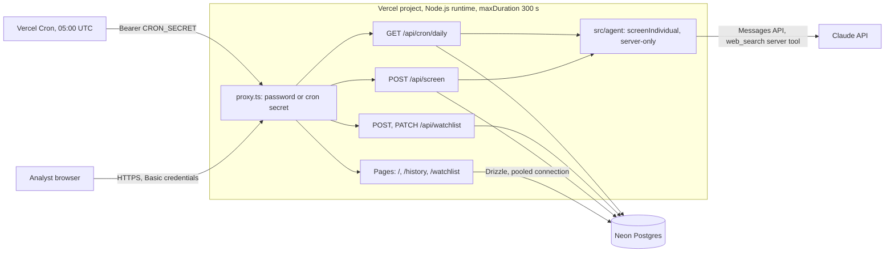
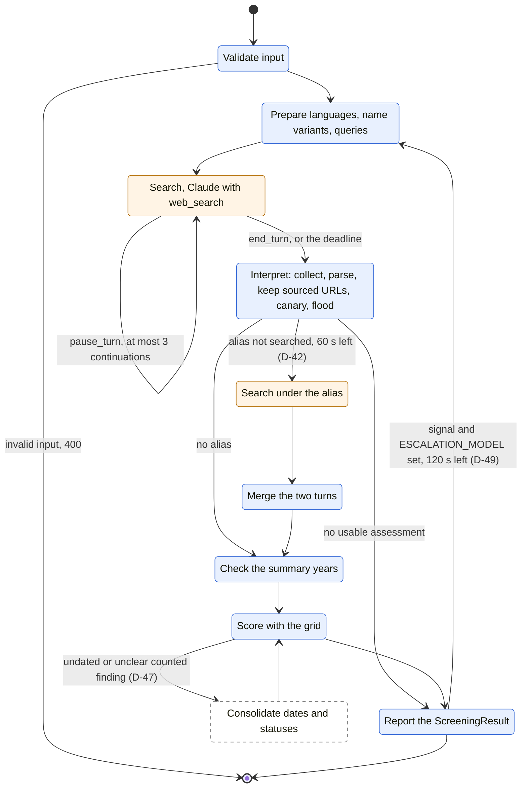

# Architecture

How the prototype is deployed, how the agent runs, what each interface accepts and returns, where
the prototype stops and the target begins, and what comes next. Figures come from
`docs/evaluation.md`; decisions are cited by their number in `docs/decisions.md`.

## 1. Overview and deployment

The screening agent is a server-side TypeScript module, `src/agent/`, that exports one function,
`screenIndividual(input): ScreeningResult`. A Next.js app on Vercel calls it from an API route,
stores every result in Neon Postgres, and re-screens the monitored persons once a day from Vercel
Cron. The agent does not import Next.js, and `import "server-only"` fails the build if a client
component ever imports it (D-15, D-16).



- **One-shot screening.** The page posts the form to `POST /api/screen`, which waits for the agent,
  stores the result and returns it. A failed write is logged; the result is returned anyway.
- **Monitoring.** `vercel.json` schedules `GET /api/cron/daily` at 05:00 UTC. It re-screens the
  monitored persons, at most `MAX_DAILY_SCREENINGS` per run, and stores only the findings whose URL
  is new for the person.
- **Access.** Every page and route asks for HTTP Basic credentials checked against `APP_PASSWORD`;
  Vercel Cron alone passes with its bearer secret (`docs/security.md`).

## 2. The agent as a state graph

The agent is a workflow in plain TypeScript, not an autonomous agent and not a framework (D-01).
Each step is a function; the conditions between them are `if` statements on explicit values. Code
prepares the queries, filters the sources and computes the risk; the model runs the searches and
judges identity and each article (D-03, D-04).

### State

The steps pass these values explicitly rather than through one object; the type names what a
checkpoint would hold.

```ts
type ScreeningState = {
  input: ScreeningInput; // first name, last name, ISO 3166-1 country, validated
  config: Config; // QUERIES_PER_LANGUAGE, EFFORT, MODEL, ESCALATION_MODEL
  plan: SearchPlan; // languages, name variants, one query per language
  outcome: SearchOutcome; // findings, articles, executed queries, aliases, errors, usage
  plannedQueries: string[]; // the plan's, then the alias plan's (D-42)
  errors: CoverageError[]; // tool errors, stop reasons, canary, flood, summary warning
  score: Score; // risk, confidence, each finding with countedInScore and riskLevel
  result: ScreeningResult; // the JSON contract returned to the caller
};
```

### Graph

Blue nodes are code, orange nodes call the model, the dashed node is planned (D-47).



- **`pause_turn`.** A long server-side search turn can pause; the paused content is sent back as is,
  three times at most, then the result is `incomplete` (D-10).
- **Errors to the report.** A refusal, a cut output, an answer that fails the schema or a deadline
  reached leave no assessment. In code the path still runs through the score, with no finding: the
  result is low at low confidence and `incomplete`, never a plain low (D-25). A canary found in the
  answer keeps the findings for the analyst, all uncounted (D-36).
- **Alias turn.** When the sources call the person by a name no query used, code runs one more turn
  under it and merges the findings of one matter (D-42).
- **Model escalation.** With `ESCALATION_MODEL` set, a result that shows a signal (a counted finding,
  an alias, a summary warning, an incomplete status) is screened again from the start on that model,
  and the second result replaces the first. Built, off by default (D-49).
- **Planned, D-47.** A second call, decided by code, that reads the pages of undated or `unclear`
  counted findings to settle their status and date. Not implemented.

### LangGraph equivalent

The same graph maps onto a LangGraph `StateGraph` in five lines:

1. `ScreeningState` becomes the graph state; each node returns the fields it changes.
2. `prepare`, `interpret`, `merge`, `summary_check`, `score` and `report` are function nodes;
   `search` and `search_alias` call the Messages API.
3. The `pause_turn` loop, the alias branch, the error path and the escalation become
   `add_conditional_edges` on the conditions the code tests today.
4. A Postgres checkpointer keyed by screening would let a run resume after a timeout or a deploy,
   and replay one node.
5. `interrupt()` before `report` would hold a result for an analyst decision (next step 3).

Criteria to migrate: a screening must survive a crash or a deploy mid-run; an analyst must step in
mid-graph and the run resume later; branches must run in parallel and join, such as one search per
language or one fetch per page; or the conditions no longer fit in one readable file. Today the
graph has nine nodes and two loops, runs synchronously, and plain TypeScript keeps each condition
visible and tested.

## 3. Interfaces

### Agent

`screenIndividual(input: ScreeningInput): Promise<ScreeningResult>`. It throws on invalid input and
on an error of the model API; every other failure is reported inside the result, in
`coverage.errors`. This JSON contract is the only thing that crosses into the app (D-15).

### `POST /api/screen`

Request, at most 2,048 bytes:

```json
{ "firstName": "Antonio", "lastName": "Rossi", "country": "IT" }
```

Names hold letters of any script, combining marks, spaces, apostrophes, periods and hyphens, up to
100 characters; angle brackets, line breaks and control characters are refused. The country is an
ISO 3166-1 alpha-2 code.

Response `200`, a `ScreeningResult`:

```ts
{
  status: "complete" | "incomplete";
  risk: "low" | "medium" | "high";
  confidence: "low" | "medium" | "high";
  modelSuggestedRisk: "low" | "medium" | "high" | null; // the model's opinion, not scored (D-51)
  riskDisagreement: boolean; // true when the opinion differs from the computed risk
  summary: string | null;
  findings: {
    url: string; // always one of the search results
    corroboratingUrls: string[];
    title: string; // from the search result, not from the model
    date: string | null; // YYYY-MM-DD, YYYY-MM or YYYY
    language: string;
    subject: "person" | "organization" | "associate";
    category: string; // fraud, money_laundering, corruption, sanctions, ...
    severity: "critical" | "moderate" | "minor";
    status: string; // allegation, investigation, indictment, conviction, sanctioned, acquitted, unclear
    identityConfidence: "low" | "medium" | "high";
    identityEvidence: string[];
    sourceReliability: string; // official, national_press, local_press, encyclopedia, blog, social, unknown
    summary: string;
    countedInScore: boolean;
    riskLevel: "low" | "medium" | "high" | null;
  }[];
  coverage: {
    languages: string[];
    countrySupported: boolean;
    plannedQueries: string[];
    executedQueries: string[];
    searchesUsed: number;
    articlesReviewed: number;
    aliases: string[];
    urlsReviewed: string[];
    rejectedUrls: string[];
    errors: { code: string; detail: string }[];
    escalatedTo: string | null;
    escalationSignals: string[];
  };
  usage: {
    inputTokens: number;
    outputTokens: number;
    cacheReadTokens: number;
    cacheWrite5mTokens: number;
    cacheWrite1hTokens: number;
    webSearches: number;
    estimatedCostUsd: number;
    apiCalls: number;
  };
  model: string;
  promptVersion: string;
  screenedAt: string;
  durationMs: number;
}
```

| status | when                                                              | body                                       |
| ------ | ----------------------------------------------------------------- | ------------------------------------------ |
| 200    | the screening ran, complete or incomplete                         | `ScreeningResult`                          |
| 400    | no body, invalid JSON, or invalid input                           | `{ error, issues?: { field, message }[] }` |
| 401    | missing or wrong credentials, from the proxy                      | text, with `WWW-Authenticate: Basic`       |
| 413    | body over 2,048 bytes                                             | `{ error }`                                |
| 429    | more than 5 screenings a minute from one address                  | `{ error }`, with `Retry-After`            |
| 500    | `APP_PASSWORD` is not set, from the proxy                         | text                                       |
| 502    | the model API failed                                              | `{ error }`                                |
| 504    | no result within 280 s; the agent itself stops searching at 240 s | `{ error }`                                |

### Watchlist

| route                       | request                                         | success                                                                                                                                | errors                                                                        |
| --------------------------- | ----------------------------------------------- | -------------------------------------------------------------------------------------------------------------------------------------- | ----------------------------------------------------------------------------- |
| `POST /api/watchlist`       | `{ firstName, lastName, country }`, 2,048 bytes | `201 { id, monitored: true, created: true }`; `200` with `created: false` when the person was recorded already, monitoring switched on | `400` invalid input, `413` too large, `503` database                          |
| `PATCH /api/watchlist/[id]` | `{ monitored: boolean }`, 256 bytes             | `200 { id, monitored }`                                                                                                                | `400` invalid body, `404` not a UUID or no such person, `413`, `503` database |

Enrolling runs no screening: the next daily run screens the person. The input schema is the one of
`POST /api/screen`.

### `GET /api/cron/daily`

Requires `Authorization: Bearer $CRON_SECRET`, checked by the proxy and again by the route.

| status | when                                                             |
| ------ | ---------------------------------------------------------------- |
| 200    | the run finished; the body is the daily summary below            |
| 401    | missing or wrong bearer                                          |
| 500    | `MAX_DAILY_SCREENINGS` is set to anything but a positive integer |
| 503    | the database did not answer; nothing was screened                |

<!-- prettier-ignore -->
```ts
{
  day: string; // UTC day, YYYY-MM-DD
  persons: number; // monitored persons
  notMonitored: number;
  maxScreenings: number; // MAX_DAILY_SCREENINGS
  screened: number;
  alreadyScreenedToday: number;
  deferred: number; // over the cap, first in the next run
  notReached: number; // not started within the 45 s start window
  failed: number;
  totalNewFindings: number;
  newFindings: { personId; screeningId; newFindings; risk; status }[];
  totalCostUsd: number;
  note: string;
  durationMs: number;
}
```

## 4. Data model

Postgres on Neon, through Drizzle (`src/db/schema.ts`). Every screening is stored, one-shot or
daily.

| table        | columns                                                                                                                                                                                                                                                                               | constraints and indexes                                                                                |
| ------------ | ------------------------------------------------------------------------------------------------------------------------------------------------------------------------------------------------------------------------------------------------------------------------------------- | ------------------------------------------------------------------------------------------------------ |
| `persons`    | `id`, `first_name`, `last_name`, `country`, `monitored` (default false), `created_at`                                                                                                                                                                                                 | unique on name and country                                                                             |
| `screenings` | `id`, `person_id`, `risk`, `confidence`, `status`, `summary`, `model`, `prompt_version`, `coverage_json`, `usage_json`, `cost_usd`, `duration_ms`, `kind` (`one_shot` or `daily`), `created_at`                                                                                       | cascade on person; indexes on date and on person; at most one `daily` screening per person and UTC day |
| `findings`   | `id`, `screening_id`, `url_hash` (SHA-256), `url`, `title`, `language`, `date`, `category`, `severity`, `status`, `subject`, `identity_confidence`, `identity_evidence`, `source_reliability`, `risk_level` (null when not counted), `summary`, `corroborating_urls`, `first_seen_at` | cascade on screening; indexes on screening and on URL hash                                             |

Risk, confidence, status and kind are Postgres enums. The classifications of a finding are text,
typed in TypeScript, because the agent's schema still changed during the build. Coverage and usage
are stored as JSON; `src/db/mapping.ts` fills the fields added after a row was written, such as
`aliases`, `escalatedTo` and `apiCalls`.

Migrations, generated by `drizzle-kit` and committed in `drizzle/`:

| migration                       | change                                                                                      |
| ------------------------------- | ------------------------------------------------------------------------------------------- |
| `0000_init`                     | the three tables, the enums and the indexes                                                 |
| `0001_daily_once_per_day`       | partial unique index: one `daily` screening per person and UTC day, against a repeated cron |
| `0002_person_monitored`         | `persons.monitored`, true by default                                                        |
| `0003_monitored_off_by_default` | false by default, and every person recorded until then set to false: enrolment is explicit  |

Target additions: a `watchlist` table with an owner and a frequency per person; analyst decisions
on findings; an audit log; a retention period (sections 7 and 8).

## 5. Prototype vs target

| topic        | prototype                                                                                                                                                                                                      | target                                                                                                                                                                                                          |
| ------------ | -------------------------------------------------------------------------------------------------------------------------------------------------------------------------------------------------------------- | --------------------------------------------------------------------------------------------------------------------------------------------------------------------------------------------------------------- |
| Split        | Modular monolith: the agent is a server-only module called by the routes, behind one JSON contract (D-15).                                                                                                     | An isolated worker, the only holder of the API key; the app submits jobs and reads results. An injection then reaches neither user sessions nor the analysts' database.                                         |
| Execution    | Synchronous: the route waits up to 280 s. Enough for one-shot screenings by up to a few dozen analysts, since each request runs in its own function and a screening takes 5 to 12 s on the fixed cases (v2.4). | A job queue, such as Inngest, QStash or Trigger.dev, with retry on failure and a status per case. Required for monitoring beyond about fifteen persons a day on this plan.                                      |
| Daily volume | One run a day on the Hobby plan; new screenings start in the first 45 s, four at a time, so 15 to 20 persons per run, capped by `MAX_DAILY_SCREENINGS`. A failed run is not retried.                           | Queued screenings spread over the day; the Messages Batches API halves the token price, about 36% less per screening at equal cache behaviour.                                                                  |
| Daily delta  | Each daily run is a full screening; only the findings whose URL hash is new for the person are stored.                                                                                                         | A date window, articles published since the last run. It cannot come from the search tool, which has no date parameter, and `after:` in the query does not filter (D-48): it needs direct access to the engine. |
| Watchlist    | `persons.monitored`, off by default; enrolment from `/watchlist` or from a screening; the analyst suspends or resumes with a button. No trace of who did what.                                                 | Enrolment with an owner, the analyst in charge of the case, a frequency per person, and an audit trail of each enrolment, suspension and resumption: who, when, why.                                            |
| Access       | HTTP Basic with one shared password; Vercel Cron by bearer secret.                                                                                                                                             | Single sign-on for analysts, roles, an access log.                                                                                                                                                              |
| Environments | One configuration: nothing separates a development key or database from the production ones.                                                                                                                   | Separate development and production: distinct API keys, each with a spend limit; distinct databases or Neon branches; distinct Vercel environments; a canary per environment.                                   |
| Prompt cache | The cached prefix carries the country through `user_location`, so screenings share it only within one country, for five minutes (D-29).                                                                        | The queue groups screenings by country, so consecutive ones read the prefix instead of writing it again. Cache writes are the largest cost item, 52% of the v2.4 cost.                                          |
| Search       | The Claude `web_search` server tool, called directly.                                                                                                                                                          | A search API called as a client tool: more results per query, a news index, a date filter (next step 2).                                                                                                        |
| Model        | Sonnet 5.5; escalation to a stronger model built and off.                                                                                                                                                      | Escalation switched on once the share of screenings that show a signal is measured in production (D-49).                                                                                                        |
| Persistence  | Three tables, every run stored, kept without limit.                                                                                                                                                            | A retention period, encryption, an access log, analyst decisions.                                                                                                                                               |

## 6. Measured dials

Three switches change the configuration without a code change. Each was measured on the fixtures
before its default was chosen (`docs/evaluation.md`).

| dial                           | options                     | measured                                                                                                                                                                                                                                                | retained   |
| ------------------------------ | --------------------------- | ------------------------------------------------------------------------------------------------------------------------------------------------------------------------------------------------------------------------------------------------------- | ---------- |
| Depth, `QUERIES_PER_LANGUAGE`  | 1 or 2 queries per language | One query cost 37% less than two on the five fixed cases, $0.6678 against $0.4220, with 9 searches instead of 17, and found the same convictions on the native cases. Two queries on the seventeen cases: +73%, two minor matters more, one wrong high. | 1          |
| Model, `MODEL`                 | Sonnet 5.5 or Opus 5.5      | Opus on seven cases: the same risks and counted findings, an alias searched without the code's help, more precise dates; $0.082 to $0.168 per screening, up to 34 s (D-09).                                                                             | Sonnet 5.5 |
| Escalation, `ESCALATION_MODEL` | unset, or a stronger model  | Opus after a Sonnet signal on seventeen cases: 14 escalated, no risk changed, counted findings 25 to 42, mostly low or medium. $0.1023 per screening if 80% show no signal; under $0.12 only up to 29% escalated (D-49).                                | off        |

Configuration retained: Sonnet 5.5, one query per language with the name repeated in every clause
(D-39), medium effort (D-30), prompt caching (D-29), no escalation. The seventeen cases pass at a
mean of $0.0864 per screening (prompt `v13`, 2026-10-02).

## 7. Next steps

Ordered by what each step unlocks for the next. Estimates are days of work for one engineer, not
measured.

1. **A fetcher of our own, secured: about 3 days.** The agent fetches pages itself, with SSRF guards
   (public addresses only, checked again after each redirect), a size limit, a timeout and an allow
   list of content types.
   - Measured case: the same article on Mouly's money-laundering investigation came back dated
     2023-06, 2024-06 and undated over three runs, and Madoff's conviction moved between the plea and
     the sentence. Reading at the model's discretion read one page in nine cases, a PDF (D-46).
   - Unlocks: a deterministic check that a page names the person before the model reads it; a check
     that each finding's quoted extract is in its page; the consolidation of D-47.
2. **Direct access to the search engine, as a client tool: about 2 days.**
   - Measured case: the server tool returns about ten results per query and has no date filter, and
     search operators do not help (D-48); the Jobs backdating matter was missed until the query form
     changed (D-39).
   - Unlocks: twenty results per query, a news index, and a freshness filter that gives the daily run
     a real date window instead of a full re-screen.
3. **Analyst decisions: about 3 days.** Confirm, dismiss, comment, or override a level with a stated
   reason; dismissed namesakes are remembered so that the daily run does not raise them again.
   - Measured case: namesakes come back at every run of the homonym cases; a blog allegation was
     counted on a Nobel laureate before D-50.
   - Unlocks: a decision trail per case, fewer repeated alerts, and labelled data to measure the agent
     against.
4. **A job queue for the daily run and one-shot screenings: about 3 days.** Retry on failure, a
   status per case, screenings spread over the day.
   - Measured case: the daily run starts screenings in its first 45 s only, 15 to 20 persons; an
     escalated screening took up to 53 s; a failed run is not retried.
   - Unlocks: monitoring beyond fifteen persons a day, the Batches API, grouping by country for the
     cache.
5. **Optional identifiers and identity enrichment: about 2 days.** Date of birth, role, organization
   and known aliases as optional inputs, passed to the model as data.
   - Measured case: identity rests on the name and the country; the Stalf case reaches N26's
     regulatory matters only as organization findings, capped at medium (D-34).
   - Unlocks: fewer namesakes counted, and matters of the person's company tied to the person.
6. **Sanctions and PEP lists through an API such as OpenSanctions: about 2 days.**
   - Measured case: the sanctions case is found through a court release on a sanctions-evasion
     conviction; no sanctions list is consulted, and politically exposed status is not covered at
     all.
   - Unlocks: an authoritative list check alongside adverse media, cheaper than a search.

LangGraph comes in if the graph grows past the criteria of section 2.

## 8. Backlog

| item                                               | state                 | note                                                                                                                                                                                            |
| -------------------------------------------------- | --------------------- | ----------------------------------------------------------------------------------------------------------------------------------------------------------------------------------------------- |
| Name particles (de, van, von, di)                  | target                | Names are normalized for spaces, case and diacritics only.                                                                                                                                      |
| Naming rules by culture                            | partial               | Variants cover both name orders and initials, not patronymics or double surnames.                                                                                                               |
| Transliteration                                    | target                | A name is searched as typed and without diacritics, in no other script.                                                                                                                         |
| CJK names                                          | not applicable        | Accepted by validation, but no country of the language table uses a CJK script: such names are searched in English only.                                                                        |
| Name frequency score                               | partial               | The model judges whether a name is common; no frequency is computed.                                                                                                                            |
| Media allow list per country                       | target                | As a reliability signal; as a search filter it would cut the regional outlets that carried the native cases.                                                                                    |
| URL canonicalization (tracking parameters, AMP)    | target                | URLs are compared as returned; an AMP copy counts as another source.                                                                                                                            |
| Syndicated copies counted as independent sources   | target                | Corroboration counts distinct domains, so a wire story copied by several sites counts several times; detecting a copy needs the full text, step 1.                                              |
| Cache per URL                                      | target                | Comes with the fetcher of step 1.                                                                                                                                                               |
| Page archiving                                     | target                | The cited page is not kept; it can change or disappear after the screening.                                                                                                                     |
| Victim, witness or lawyer role                     | partial               | An article where the person is a victim, a witness or a lawyer is not adverse media; the prompt reports only negative information about the person, and `subject` has no value for these roles. |
| Periodic full rescan                               | in place              | Every daily run is a full screening; only storage is a delta.                                                                                                                                   |
| Notification on change                             | target                | New findings show in `/history` and in the cron summary; nobody is alerted.                                                                                                                     |
| Cron retries                                       | partial               | No retry; the persons not reached come first in the next run.                                                                                                                                   |
| `risk_history` and `audit_log`                     | partial               | Each screening keeps its risk, so the history per person exists; there is no audit log.                                                                                                         |
| CSV import                                         | target                |                                                                                                                                                                                                 |
| PDF export                                         | target                |                                                                                                                                                                                                 |
| Roles                                              | target                | One shared password today.                                                                                                                                                                      |
| Metrics per language                               | partial               | The run log keeps figures per screening, with no breakdown by language.                                                                                                                         |
| Expected URLs per test case                        | target                | The articles each case should find, recorded with the case, would measure the recall of the search apart from the analysis of what it returns.                                                  |
| Data protection impact assessment, GDPR article 10 | target                | Required before use in production: article 10 allows data on criminal offences only under official authority or when authorized by law with safeguards.                                         |
| Reading pages in full at the model's discretion    | measured and rejected | One page read in nine cases, a PDF, no date corrected (D-46).                                                                                                                                   |
| Search operators in the query                      | measured and rejected | `inpage:`, `intitle:` and `after:` do worse than the D-39 form (D-48).                                                                                                                          |
